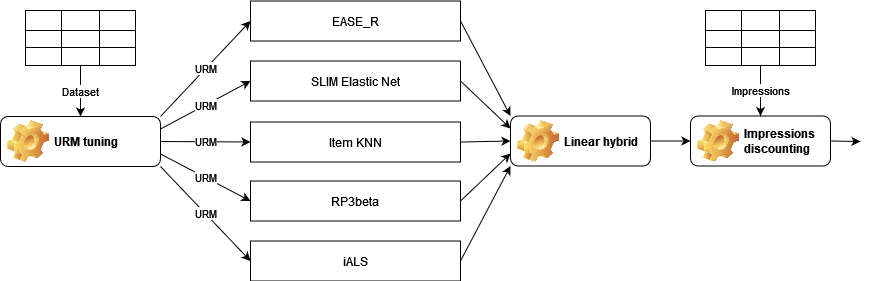

# Recommender Systems challenge - Politecnico di Milano, 2022
In this repository there is the code I used for the challenge of the Recommender Systems course at Politecnico di Milano.

The goal of the competition was to create the recommender system TV programs by providing 10 recommended products to each target user.

[Link to the official website of the challenge](https://www.kaggle.com/competitions/recommender-system-2022-challenge-polimi)

### Evaluation
I arrived **2nd** in the competition with 83 participating team. My final MAP in the private leaderboard is **0,06110**.

## Data
The dataset represents the interactions between the users and the items of a streaming platform. The item can have different types and different length (movies, TV series, ...).

A full description of the data is available [at the challenge webpage](https://www.kaggle.com/competitions/recommender-system-2022-challenge-polimi/data). The main source file is `interactions_and_impressions.csv` which contains the interactions of each user with the items, for example:
| UserID | ItemID | Impressions                                       | Data |
| ------ | ------ | ------------------------------------------------- | ---- |
| 0      | 11     | 0,1,2,3,4,5,6,7,8,9,10,11,12,13,14,15,16,17,18,19 | 1    |
| 0      | 21     |                                                   | 0    |
| 0      | 21     |                                                   | 0    |
| 0      | 21     | 20,21,22,23,24,25,26,27,28,29                     | 0    |

Where:
- `Data` is `0` if the user watched the item, `1` if the user opened the item details page.
- `Impressions`: string containing the items that were present on the screen when the user interacted with the item in column `ItemID`. Not all interactions have a corresponding impressions list.

## Recommender
The recommender architecture is roughly the following:

The main body of the recommender is a linear hybrid which composes the item weights of its base recommenders (SLIM elastic net, item KNN, EASE_R, RP3beta, iALS).

The key point is that **each base recommender uses a different tuned URM**. The URM are composed taking into account the number of views and the number of "opening the details page" each user-item pair has, using the following formula:
$$URM[user, item] = \log_b{(w_{views}*n_{views} + w_{details}*n_{details} + 1)}$$

Where the weights $w_{views}$ and $w_{details}$ are fund by hyperparameters tuning. To do this the base recommenders are first trained on a default URM which uses $\log_2{(1*n_{views} + 0.8*n_{details} + 1)}$ and then the best model is tested against different values of $w_{views}$ and $w_{details}$ to find the best URM for that specific model. I have used the $log()$ function because it follows the behavior that the first interactions with an item are more important.

Once the best URMs have been found the models are composed in a linear hybrid and their weights found by hyperparameters tuning.

The last step is to include impressions. This is done using the [impression discounting](https://dl.acm.org/doi/10.1145/2623330.2623356) technique in which each item which was recommended but not chosen by the user is penalized; this has been implemented multiplying the score for the exponential of the impressions:
$$new = old * e^{\alpha*k+\beta}$$
Where $k$ is the number of impressions while $\alpha$ and $\beta$ are found with hyperparameters tuning. Note that $\alpha < 0$ which means that the score of an item gets exponentially smaller with the increasing of the impressions.

## Run this code
### Prerequisites
- [Python 3.8](https://www.python.org/)
- [Poetry](https://python-poetry.org/)
- [Cython](https://cython.org/) configured (C compiler)

### Setup
- Install packages with [Poetry](https://python-poetry.org/docs/basic-usage/#installing-dependencies)
- In the Poetry environment compile the Cython modules with `python run_compile_all_cython.py`

### Train and tune
To train and tune the recommender the following file have to be run sequentially:
- `1_tune_base_recommenders.py`: trains and tune the base recommenders
- `2_tune_URM.py`: tune the URM of each recommender
- `3_tune_linear_hybrid.py`: tune the linear hybrid of the base recommenders
- `4_tune_impression_discounting.py`: the the parameters of the impression discounting step

## Credits
The code in this repository is inspired by [MaurizioFD/RecSys_Course_AT_PoliMi](https://github.com/MaurizioFD/RecSys_Course_AT_PoliMi), a repository used during the Recommender Systems course at Politecnico di Milano.
